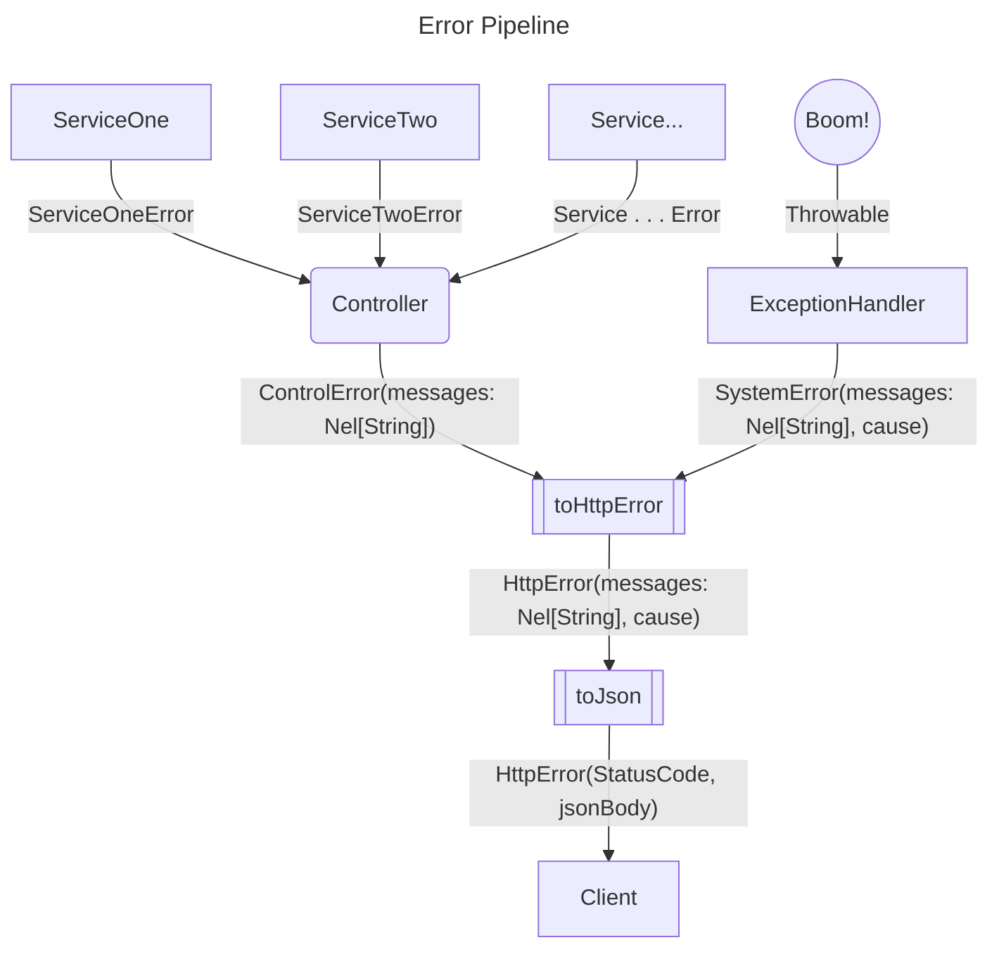

<pre style="background: transparent; padding: 0">
     |\__/,|   (`\
   _.|o o  |_   ) )
---(((---(((-----------
Book Cat ¯\_(ツ)_/¯ Zio
</pre>

### Error Handling Pipeline

```mermaid
---
title: "Error Pipeline"
config:
    fontSize: 20
---
flowchart
    ServiceOne -- ServiceOneError --> ctrl
    ServiceTwo -- ServiceTwoError --> ctrl
    Service... -- Service . . . Error --> ctrl
    ctrl(Controller) -- " ControlError(messages: Nel[String]) " --> toHttpError[[toHttpError]]
    toHttpError -- " HttpError(messages: Nel[String], cause) " --> json[[toJson]]
    json -- " HttpError(StatusCode, jsonBody) " --> Client
    UnexpectedFailure((Boom!)) -- Throwable --> ExceptionHandler
    ExceptionHandler -- " SystemError(messages: Nel[String], cause) " --> toHttpError
```
