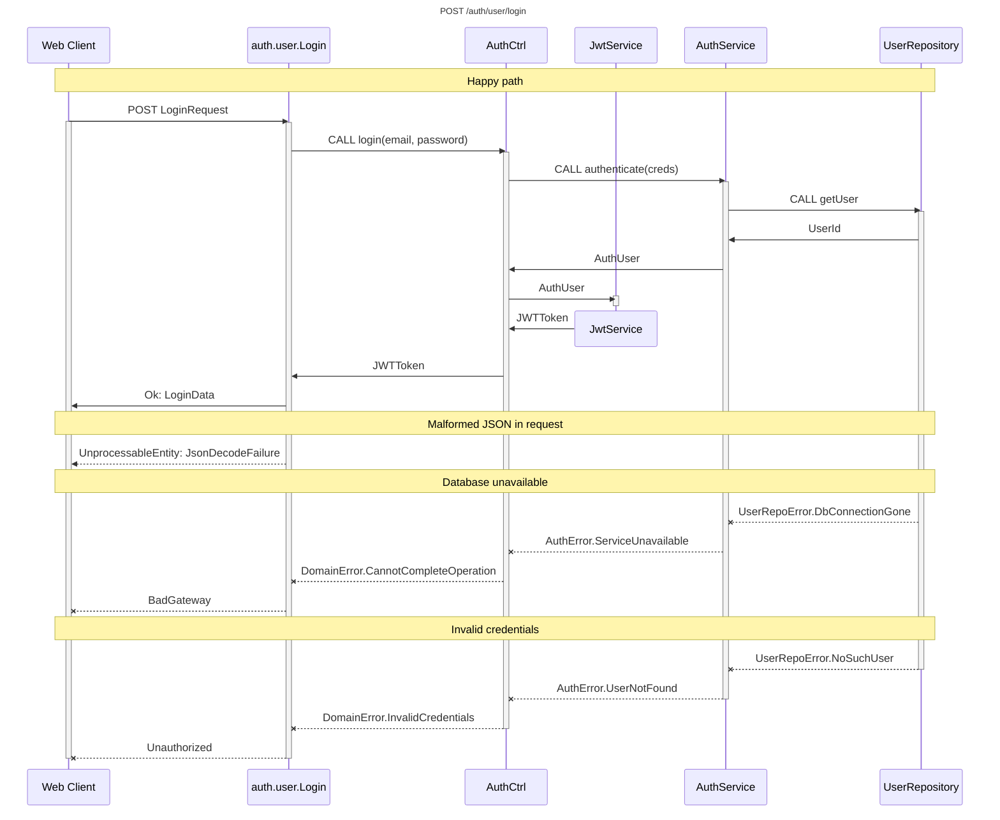
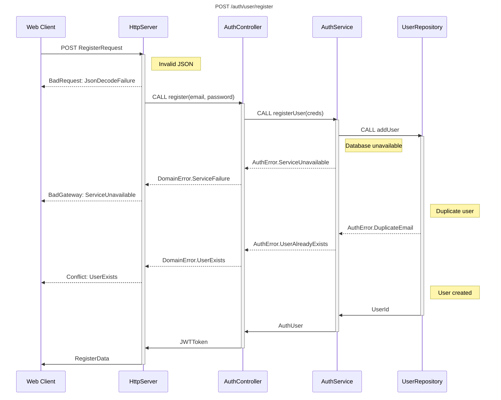

<pre style="background: transparent; padding: 0">
     |\__/,|   (`\
   _.|o o  |_   ) )
---(((---(((-----------
Book Cat ¯\_(ツ)_/¯ Zio
</pre>
### User Authentication
 [Login](#login)
 [Register](#register)
 [Reset Password](#reset-password)
 
 

#### Login

#### Reset Password

#### Register

